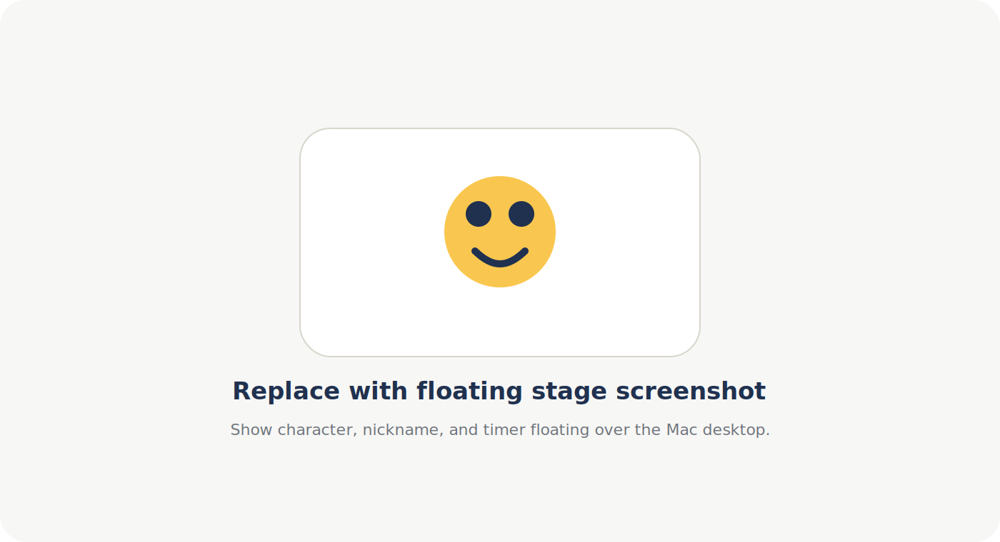
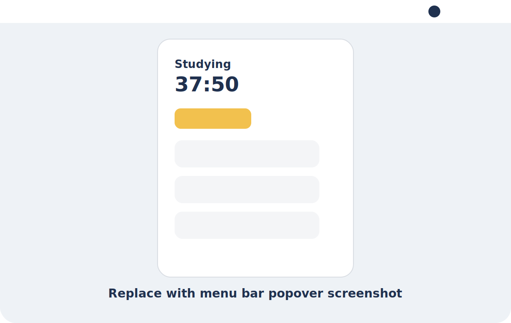
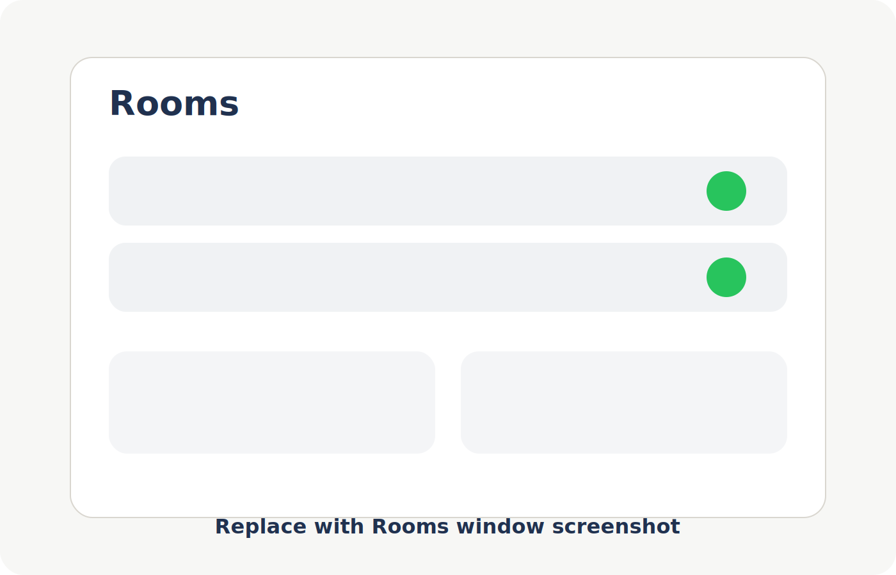
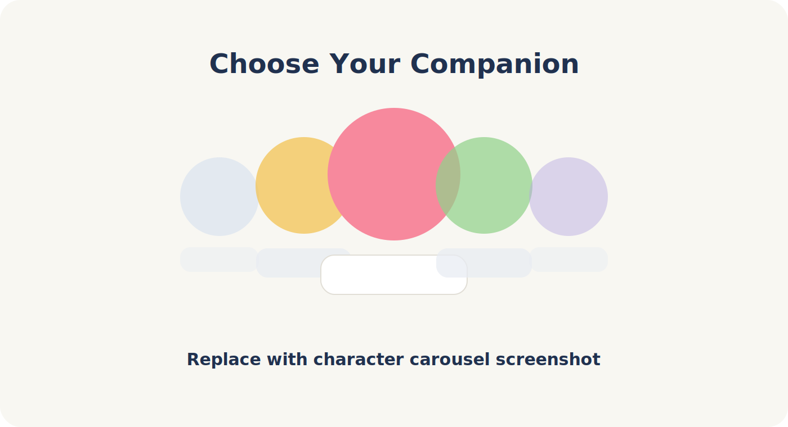
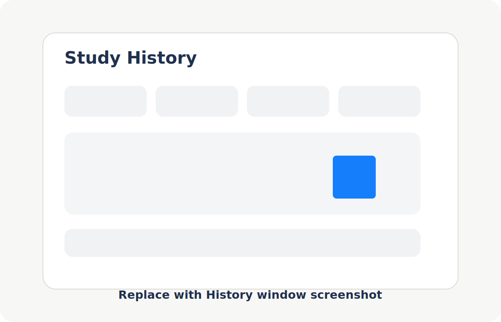

# Pawfficer

**A tiny floating focus companion for Mac.**

Pawfficer는 공부하거나 작업하는 동안 화면 한쪽에 작게 떠 있는 동물 친구들과 함께 집중 상태를 공유하는 macOS 앱입니다. 방을 만들고 친구를 초대하면, 각자의 귀여운 캐릭터가 공부 중이거나 쉬는 중인 상태를 가볍게 보여줍니다.

[Download Pawfficer](https://github.com/HahnGyuTak/Pawfficer-Releases/releases/latest)

## What It Does

- 메뉴 막대에서 집중/휴식 상태를 빠르게 전환합니다.
- 원하는 방 하나를 선택해 플로팅 캐릭터 창으로 띄웁니다.
- 방마다 내 캐릭터 표시 여부를 켜고 끌 수 있습니다.
- 친구들의 최근 집중 상태를 방에서 확인합니다.
- 내 장기 학습 기록은 이 Mac에 로컬로 저장합니다.

## Rooms

방을 만들고 초대 코드를 공유하면 친구들이 같은 공간에 들어올 수 있습니다. 각 방에서 내 캐릭터를 연결하거나 숨길 수 있고, 플로팅으로 띄울 방은 하나만 선택됩니다.

## Floating Companions

플로팅 창은 작업을 방해하지 않도록 최대한 가볍게 유지됩니다. 캐릭터, 닉네임, 타이머만 보여주고, 상태 전환이나 방 선택 같은 조작은 메뉴 막대에서 처리합니다.

캐릭터를 클릭하면 공부 상태와 휴식 상태를 전환할 수 있습니다. 연결이 끊어진 친구는 설정에 따라 숨기거나 잠자는 상태로 볼 수 있습니다.

## History

내 학습 기록은 이 Mac에 저장됩니다. History 화면에서는 오늘, 이번 주, 세션별 기록을 확인할 수 있습니다.

방에서 친구들과 공유되는 최근 집중 요약은 제한적으로만 사용되며, 장기 개인 기록과 분리됩니다.

## Install

1. [Latest Release](https://github.com/HahnGyuTak/Pawfficer-Releases/releases/latest)에서 `.dmg` 파일을 다운로드합니다.
2. `Pawfficer-0.1.0-build3.dmg`를 엽니다.
3. `Pawfficer.app`을 `Applications` 아이콘으로 드래그합니다.
4. Applications 폴더에서 Pawfficer를 실행합니다.

Pawfficer는 Apple Developer ID로 서명되고 notarization이 완료된 빌드로 배포됩니다.

## Privacy

Pawfficer는 화면, 실행 중인 앱, 키보드 입력, 카메라, 마이크, 파일을 검사하지 않습니다.

- 개인 학습 기록: 이 Mac에 로컬 저장
- 서버 사용: 방 멤버십, 초대 코드, 실시간 presence, 최근 공유용 방 요약
- 지원 이메일: `gue707@naver.com`

## Screenshot Guide

이 repo의 이미지는 현재 placeholder입니다. 실제 앱 스크린샷을 추가할 때는 아래 파일을 교체하거나 README 링크를 PNG 파일명으로 바꾸면 됩니다.

- `assets/screenshots/01-floating-stage.svg`: 바탕화면 위에 떠 있는 캐릭터 플로팅 창
- `assets/screenshots/02-menu-bar.svg`: 메뉴 막대 아이콘 클릭 시 나오는 상태/방 조작 패널
- `assets/screenshots/03-rooms.svg`: Rooms 화면, 방 목록, create/join 영역
- `assets/screenshots/04-character-carousel.svg`: 첫 설정 또는 Settings의 캐릭터 선택 캐러셀
- `assets/screenshots/05-history.svg`: History 화면의 today/week/session 요약

권장 캡처 크기:

- 넓은 화면: 1400 x 900 정도
- 메뉴바 팝오버: 600 x 900 정도
- 플로팅 창: 배경이 깔끔한 바탕화면 위에서 캡처

## Release Repository

This repository is for public Pawfficer downloads only. The app source code is not distributed here.
